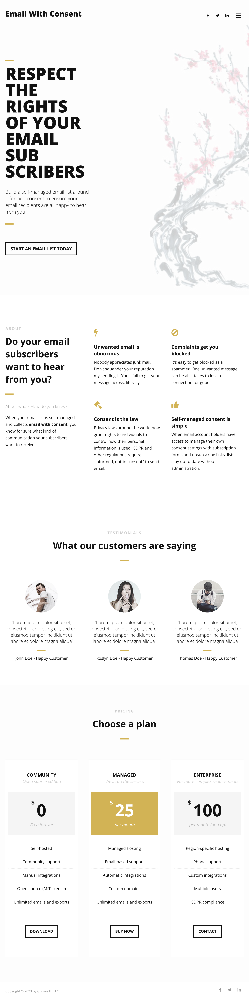

# CHANGELOG

Captain's log. A secret history of Grimes IT.

## October 9, 2023

October 1 is the commemorated birthday of the new Grimes IT--it's my first day working at Grimes IT full time, though I began filing paperwork and opening accounts on August 27. So today is the start of the company's second full week, and I thought I should take a quick snapshot for history. 

By this point, a lot of the basic business infrastructure in place.

- Registered Grimes IT, LLC with the NC Secretary of State.
- Opened a Grimes IT checking account, a business credit card, and a couple high-yield savings accounts for startup capital and tax set-asides.
- Created a Grimes IT website for consulting (with vague hints of a product business to come).

- Created a new AWS account for Grimes IT and started getting Docker working with ECS and EC2.
- Created a "hello docker" application for experimenting with infrastructure.
- Created a landing page and sketched out a business model for an email subscription list app that respects user consent: [Email With Consent](https://carefulcontacts.com). Ended up cooling on the business model, but planning to keep it as a product pitch, to show on the website under "Prototypes" as a sort of portfolio.

- I registered the domain carefulcontacts.com early in the process, which I regretted within days.
  - **Lesson learned**: Don't register a the domain name too soon. Branding and terminology can change a lot in early stages. Instead, use a subdomain for as long as possible.
- Set up bookkeeping, finance overview, and roughed out budgets with the Google Spreadsheets extension "Tiller". 

